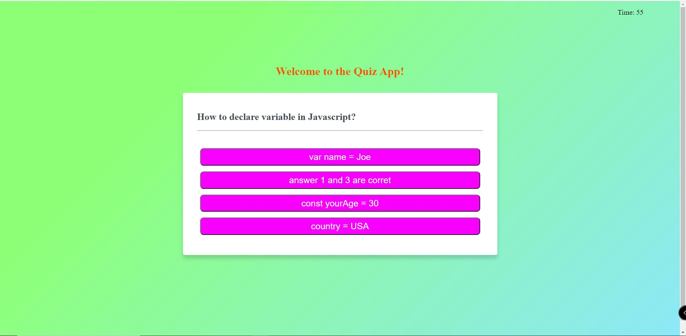

# QuizGame
Link to github repo: https://github.com/stevenbong96/QuizGame
Link to the website: https://stevenbong96.github.io/QuizGame/

Week 3 HW #1 Quiz Game App

The overall scope of this HW is to enhance the students ability in utilizing Javascript to build a simple quiz application along with several minimum requirements. This HW also utilizes HTML and CSS to build this Quiz App. For this HW, students need to make all the files from the scratch and use their own creativity to build the whole Quiz App. There are several steps that I took to build this Quiz App, which listed as below:
1.  Started by making the HTML file on how to layout the quiz
2.  Style the HTML file using the CSS file 
3.  Made the JS file to do all the user interfacing commands
4.  Then, in JS file, first declare the variables to get the elementbyId form HTML
5.  Create several function for each task that you would like to work i.e. setTimer() function, selectedAnswer() function, storedQuiz() function, etc.
6.  Add the button eventlistener command for the user to be able to work the quiz, set it to the next question, and direct them to the result page
7.  Made another form for the user to put their name into the list and store it to the local storage, so the input will not be deleted every time the user start the quiz again

Screenshot of what I made for this Quiz App listed below:

